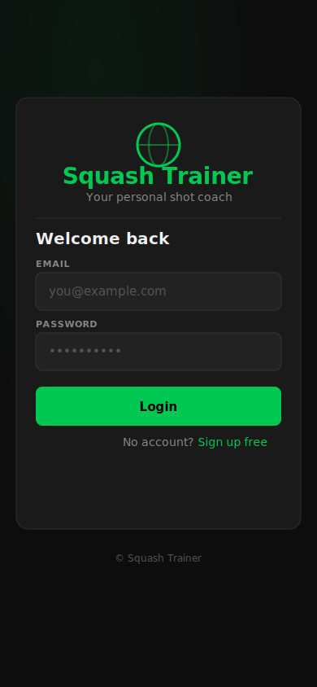
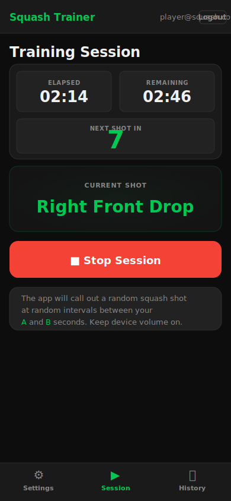
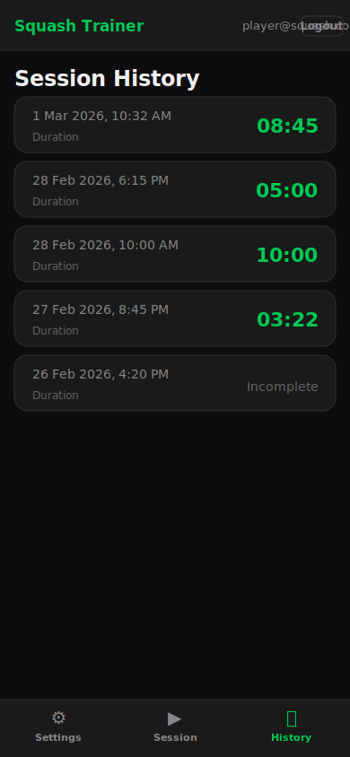

# Squash Trainer

A browser-based and Android squash training app that calls out random shot prompts at random intervals to keep your footwork sharp.

> **Paid Android app (€1) · Supabase cloud database (free tier) · No backend hosting required**

---

## Screenshots

<p align="center">
  
  &nbsp;&nbsp;&nbsp;
  
  &nbsp;&nbsp;&nbsp;
  
</p>

<p align="center">
  <em>Login &nbsp;·&nbsp; Active Session &nbsp;·&nbsp; History</em>
</p>

---

## Features

- **Random shot prompts** — the app announces a random squash shot (e.g. *Right Front Drop*, *Cross Court Drive*) using the device's built-in text-to-speech at random intervals between **A** (min) and **B** (max) seconds
- **Configurable settings** — set your own A / B interval window and total session duration (C)
- **Session history** — every session is saved to the cloud with its start time and duration
- **Persistent login** — Supabase handles auth; you stay logged in across app restarts

---

## Project Structure

```
squash_timer_app/
│
├── frontend/                      # Web UI — served statically, bundled into the APK
│   ├── index.html                 # Single-page app shell (all views as hidden divs)
│   ├── Dockerfile                 # nginx image: serves static files, proxies /api to backend
│   ├── nginx.conf                 # nginx SPA config with /api reverse proxy
│   ├── css/
│   │   └── style.css              # Dark theme, mobile-first, CSS custom properties
│   └── js/
│       ├── supabase.min.js        # Supabase JS SDK v2 (vendored — no CDN at runtime)
│       ├── supabase-config.js     # ⚠️  Your project URL + anon key (fill in before building)
│       └── app.js                 # All app logic: auth, settings, session timer, history
│
├── supabase/
│   └── schema.sql                 # PostgreSQL schema + Row Level Security policies
│                                  # Run once in the Supabase SQL Editor to set up tables
│
├── backend/                       # Optional — only needed for local browser development
│   ├── server.js                  # Express entry point; serves frontend as static files
│   ├── db.js                      # SQLite connection + schema bootstrap (async sqlite3)
│   ├── Dockerfile                 # Node 18-alpine image; uses package-lock.json for reproducibility
│   ├── package.json               # Direct dependencies
│   ├── package-lock.json          # Locked dependency tree (used by Docker and npm ci)
│   ├── .env.example               # Copy to .env and fill in JWT_SECRET
│   ├── schema.sql                 # Reference SQLite schema (mirrors supabase/schema.sql)
│   ├── middleware/
│   │   └── auth.js                # JWT Bearer-token middleware
│   └── routes/
│       ├── auth.js                # POST /api/signup  POST /api/login
│       ├── settings.js            # GET|POST /api/settings
│       └── sessions.js            # POST /api/session/start|end  GET /api/session/history
│
├── android/                       # Capacitor Android project (generated — do not edit manually)
│   ├── app/
│   │   ├── build.gradle           # App-level Gradle config; signing config stub lives here
│   │   └── src/main/
│   │       ├── AndroidManifest.xml
│   │       ├── assets/public/     # Frontend files copied here by `npm run sync`
│   │       └── java/…/            # Capacitor MainActivity
│   └── …                         # Gradle wrapper, variables, settings
│
├── docs/
│   └── screenshots/               # SVG UI mockups used in this README
│
├── docker-compose.yml             # Runs frontend + backend as separate containers
├── .env.example                   # Root env template for docker-compose (JWT_SECRET)
├── capacitor.config.json          # Capacitor: appId, appName, webDir = "frontend"
└── package.json                   # Root: Capacitor CLI + Android adapter
```

### Key file descriptions

| File | Purpose |
|------|---------|
| `frontend/js/app.js` | The entire client-side brain: Supabase auth, settings persistence, session timer loop, shot scheduler, Web Speech API calls |
| `frontend/js/supabase-config.js` | **Fill this in** with your Supabase URL and anon key before building |
| `frontend/nginx.conf` | nginx config: serves static files and reverse-proxies `/api/*` to the backend container |
| `supabase/schema.sql` | Creates `user_settings` and `session_history` tables with RLS so users can only see their own rows |
| `backend/server.js` | Express server for local browser testing; not needed for the Android app |
| `backend/package-lock.json` | Locked dependency tree — ensures reproducible installs inside Docker (`npm ci`) |
| `docker-compose.yml` | Orchestrates the `frontend` (nginx) and `backend` (Node.js) containers locally |
| `android/app/build.gradle` | Contains the release signing config stub; uncomment and fill in keystore details before generating the signed AAB |
| `capacitor.config.json` | Tells Capacitor the app ID (`com.squashtrainer.app`) and that `frontend/` is the web root |

---

## Architecture

**Production (Android app):**

```
Android App  (Capacitor WebView wrapping the frontend)
     │
     │  HTTPS — Supabase JS SDK
     ▼
Supabase  (free tier)
  ├── auth.users          ← managed by Supabase Auth
  ├── public.user_settings
  └── public.session_history
```

The backend Express server is **not deployed** in production. The frontend talks directly to Supabase using the public anon key; Row Level Security policies ensure each user can only access their own data.

**Local Docker setup:**

```
Browser → localhost:3000
               │
               ▼
    [frontend container — nginx]
       /api/*  │  static files
               ▼
    [backend container — Node.js :3001]
               │
               ▼
        SQLite (Docker volume)
```

---

## How to Run

### Option A — Android app (production)

#### Prerequisites
- [Android Studio](https://developer.android.com/studio) + JDK 17+
- A [Supabase](https://supabase.com) account (free)

#### 1. Set up Supabase

1. Create a new Supabase project
2. Go to **SQL Editor → New query**, paste `supabase/schema.sql`, and click **Run**
3. Go to **Authentication → Settings** and disable **Email Confirmations**
4. Go to **Settings → API** and copy your **Project URL** and **anon / public key**
5. Paste them into `frontend/js/supabase-config.js`:

```js
const SUPABASE_URL      = 'https://xxxxxxxxxxxx.supabase.co';
const SUPABASE_ANON_KEY = 'eyJ...your-anon-key...';
```

#### 2. Sync and open in Android Studio

```bash
cd ~/Desktop/squash_timer_app

# Install Capacitor dependencies (one-time)
npm install

# Copy latest frontend assets into the Android project
npm run sync

# Open the Android project in Android Studio
npm run open
```

#### 3. Build the signed release AAB

Generate a signing keystore (one-time — keep this file safe forever):

```bash
keytool -genkey -v \
  -keystore ~/squash-trainer-release.keystore \
  -alias squash-trainer \
  -keyalg RSA -keysize 2048 -validity 10000
```

Edit `android/app/build.gradle` — fill in the four commented lines in `signingConfigs.release`, then uncomment the `signingConfig` line in `buildTypes.release`.

In Android Studio: **Build → Generate Signed Bundle / APK → Android App Bundle**.

#### 4. Upload to Google Play

1. Create a [Google Play Developer account](https://play.google.com/console) ($25 one-time fee)
2. **Create app** → App type: App → Paid: **€1.00**
3. Fill in the store listing, set content rating, upload the `.aab` file
4. Submit for review

---

### Option B — Docker (recommended for local development)

Two containers are started:

| Container | Image | Role | Port |
|-----------|-------|------|------|
| `frontend` | nginx:alpine | Serves static HTML/CSS/JS; reverse-proxies `/api/*` to the backend | `3000` → `80` |
| `backend` | node:18-alpine | Express REST API + SQLite | internal `3001` |

SQLite data is stored in a named Docker volume (`db_data`) so it survives container restarts.

#### Prerequisites
- [Docker Desktop](https://www.docker.com/products/docker-desktop/) (or Docker Engine + Compose plugin)

#### Steps

```bash
cd ~/Desktop/squash_timer_app

# 1. Create your environment file
cp .env.example .env          # edit JWT_SECRET if desired

# 2. Build images and start both containers
docker compose up --build

# 3. Open the app
# http://localhost:3000
```

To stop:

```bash
docker compose down
```

To stop **and delete** the SQLite data volume:

```bash
docker compose down -v
```

To rebuild after code changes:

```bash
docker compose up --build
```

#### How the containers communicate

```
Browser → http://localhost:3000
              │
              ▼
       [frontend — nginx]
          │          │
          │ /api/*   │ everything else
          ▼          ▼
   [backend:3001]  static files
    Express API     (HTML/CSS/JS)
          │
          ▼
    SQLite (db_data volume)
```

> **Note:** the Docker / local backend uses a separate authentication system (JWT + SQLite) from the Android app (Supabase). Accounts are not shared between the two modes.

---

### Option C — Local browser development (without Docker)

The backend Express server runs directly on your machine. You do **not** need Supabase credentials for this mode.

#### Prerequisites
- Node.js 18+

```bash
# Install backend dependencies
cd ~/Desktop/squash_timer_app/backend
cp .env.example .env          # edit JWT_SECRET if desired
npm install

# Start the server
npm start
```

Open **http://localhost:3000** in your browser.

---

## Technology Stack

| Layer | Technology | Notes |
|-------|-----------|-------|
| UI | HTML5 / CSS3 / Vanilla JS | No framework — single `index.html` SPA |
| Audio | Web Speech API | Built into the browser/WebView; no audio files |
| Android wrapper | [Capacitor 6](https://capacitorjs.com) | Wraps the web app in a native WebView |
| Cloud database | [Supabase](https://supabase.com) | Free tier: 500 MB PostgreSQL, 50 K monthly users |
| Local dev backend | Node.js + Express + SQLite | Optional; for browser testing without Supabase |
| Auth | Supabase Auth (app) / JWT + bcrypt (local) | 7-day session tokens |

---

## Squash Shots

The app randomly selects from this list at each interval:

Right Front Drop · Left Front Drop · Right Front Lob · Left Front Lob · Right Back Drive · Left Back Drive · Right Back Boast · Left Back Boast · Cross Court Drive · Straight Drive · Trickle Boast · Reverse Angle · Volley Drop · Volley Drive · Nick Shot

---

## Cost Summary

| Item | Cost |
|------|------|
| Supabase (free tier) | **€0 / month** |
| Google Play Developer account | **$25 one-time** |
| Google's revenue share | **15%** (~€0.85 per download) |
